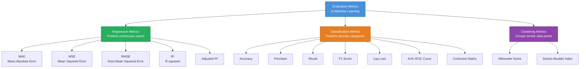
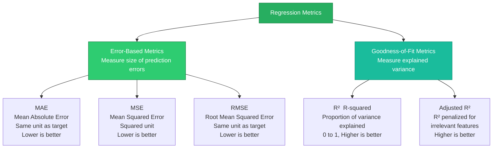
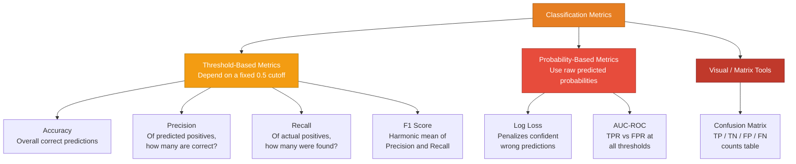
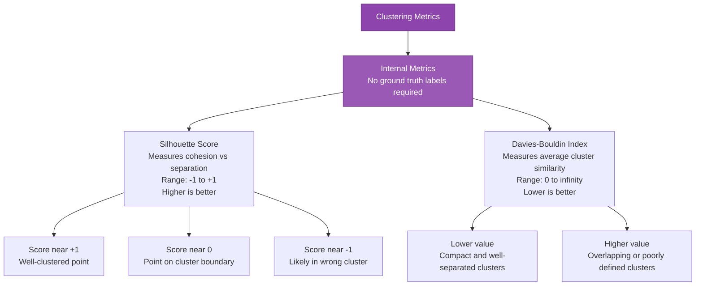

# Evaluation Metrics in Machine Learning

Evaluation metrics are used to measure how well a machine learning model performs. They help assess whether the model is making accurate predictions and meeting the desired goals. This is important because:

- **Model Performance** — Measures how well the model works
- **Different Tasks** — Used for classification, regression, and clustering
- **Right Metric Choice** — Helps select the best way to evaluate a model
- **Better Decisions** — Ensures the model meets its objectives

---

## Table of Contents

- [Overview: Types of Evaluation Metrics](#overview-types-of-evaluation-metrics)
- [Regression Metrics](#regression-metrics)
  - [What Are Regression Metrics?](#what-are-regression-metrics)
  - [Where Are Regression Metrics Used?](#where-are-regression-metrics-used)
  - [1. Mean Absolute Error (MAE)](#1-mean-absolute-error-mae)
  - [2. Mean Squared Error (MSE)](#2-mean-squared-error-mse)
  - [3. Root Mean Squared Error (RMSE)](#3-root-mean-squared-error-rmse)
  - [4. R-squared (R²)](#4-r-squared-r)
  - [5. Adjusted R-squared (Adjusted R²)](#5-adjusted-r-squared-adjusted-r)
- [Classification Metrics](#classification-metrics)
  - [1. Accuracy](#1-accuracy)
  - [2. Precision](#2-precision)
  - [3. Recall (Sensitivity)](#3-recall-sensitivity)
  - [4. F1 Score](#4-f1-score)
  - [5. Logarithmic Loss (Log Loss)](#5-logarithmic-loss-log-loss)
  - [6. Area Under Curve (AUC) and ROC Curve](#6-area-under-curve-auc-and-roc-curve)
  - [7. Confusion Matrix](#7-confusion-matrix)
- [Clustering Metrics](#clustering-metrics)
  - [1. Silhouette Score](#1-silhouette-score)
  - [2. Davies-Bouldin Index](#2-davies-bouldin-index)

---

## Overview: Types of Evaluation Metrics

---

## Regression Metrics

### What Are Regression Metrics?

Regression metrics are numerical measures used to evaluate how well a regression model predicts **continuous target values**. Unlike classification tasks (which predict discrete labels like "spam / not spam"), regression tasks predict quantities — such as house prices, student salaries, temperatures, or delivery times — and regression metrics tell us **how far off the predictions are from the true values**.

The **residual (error)** for a single prediction is:

$$e_i = y_i - \hat{y}_i$$

- Positive residual → model **under-predicted**
- Negative residual → model **over-predicted**

Regression metrics aggregate these residuals in different ways. Some measure the **size of errors** (MAE, MSE, RMSE), others measure **how much variation the model explains** (R², Adjusted R²). Using multiple metrics together gives the most complete picture.

---

### Regression Metrics Map

---

### Where Are Regression Metrics Used?

Regression metrics are applied in any domain where a model predicts a **numerical output**:

| Domain | Example Target Variable | Common Metrics |
|:---|:---|:---|
| **Recruitment / HR** | Salary / placement package prediction | MAE, Adjusted R² |
| **Real Estate** | House price prediction | MAE, RMSE |
| **Finance** | Stock price, loan amount forecasting | RMSE, R² |
| **Healthcare** | Patient recovery time, drug dosage | MAE, RMSE |
| **E-Commerce** | Demand forecasting, delivery time | MAE, RMSLE |
| **Energy** | Power consumption forecasting | RMSE, MAPE |
| **Climate Science** | Temperature, rainfall forecasting | RMSE, R² |

---

### Metrics Overview

| # | Metric | What It Measures | Better When |
|:---:|:---|:---|:---:|
| 1 | **MAE** | Average absolute error (same unit as target) | Lower ↓ |
| 2 | **MSE** | Average squared error (penalizes large errors heavily) | Lower ↓ |
| 3 | **RMSE** | Square root of MSE (back to original units) | Lower ↓ |
| 4 | **R²** | Proportion of target variance explained by model | Higher ↑ (max = 1) |
| 5 | **Adjusted R²** | R² penalized for adding irrelevant features | Higher ↑ (max = 1) |

---

### 1. Mean Absolute Error (MAE)

**Formula:**

$$MAE = \frac{1}{n} \sum_{i=1}^{n} |y_i - \hat{y}_i|$$

**What it measures:**
MAE is the average size of the errors, ignoring direction. Every error — large or small — is treated **equally**.

**How to interpret:**
An MAE of 0.50 LPA means: *"On average, the model's package prediction is off by ₹0.50 LPA."* This is directly human-readable because it is in the same unit as the target.

**When to use MAE:**
- When all errors are equally important (no preference for penalizing outliers)
- When you need a metric that non-technical stakeholders can understand
- When the data has outliers and you don't want them to dominate the score

| Pros | Cons |
|:---|:---|
| Easy to interpret — same unit as target | Treats small and large errors equally |
| Robust to outliers | Not differentiable at zero (optimization issue) |
| Directly meaningful in business context | Does not tell you if errors are systematic |

---

### 2. Mean Squared Error (MSE)

**Formula:**

$$MSE = \frac{1}{n} \sum_{i=1}^{n} (y_i - \hat{y}_i)^2$$

**What it measures:**
The average of the **squared** errors. Squaring ensures large errors contribute far more than small ones.

**How to interpret:**
An MSE of 0.12 LPA² means the average squared error is 0.12. The unit is squared and less intuitive — MSE is most useful for comparing models or as a training loss, not for direct communication.

**When to use MSE:**
- As a **loss function during model training** (differentiable and smooth)
- When large prediction errors are especially unacceptable (safety-critical systems)
- When comparing models mathematically

| Pros | Cons |
|:---|:---|
| Penalizes large errors heavily | Units are squared — not directly interpretable |
| Differentiable everywhere — ideal for gradient-based optimization | Sensitive to outliers |
| Widely used as a training loss | Direction of errors is lost |

---

### 3. Root Mean Squared Error (RMSE)

**Formula:**

$$RMSE = \sqrt{MSE} = \sqrt{\frac{1}{n} \sum_{i=1}^{n} (y_i - \hat{y}_i)^2}$$

**What it measures:**
The square root of MSE — brings the metric back to the **same unit as the target** while still penalizing large errors more than MAE does.

**How to interpret:**
An RMSE of 0.35 LPA means: *"Typical predictions deviate from the true value by about ₹0.35 LPA, with large errors weighted more."*

> **Tip:** If `RMSE >> MAE`, the model is making a few **very large errors** (outliers dominating). If `RMSE ≈ MAE`, errors are consistent in size.

**When to use RMSE:**
- When large errors are more costly than small ones
- As a general-purpose metric when you want interpretability and outlier sensitivity
- When comparing models on the same dataset

| Pros | Cons |
|:---|:---|
| Same unit as target — interpretable | More sensitive to outliers than MAE |
| Penalizes large errors more heavily | Can be misleading if outliers are not genuine |
| Standard metric for regression benchmarks | Direction of bias is lost |

---

### 4. R-squared (R²)

**Formula:**

$$R^2 = 1 - \frac{SS_{res}}{SS_{tot}} = 1 - \frac{\sum(y_i - \hat{y}_i)^2}{\sum(y_i - \bar{y})^2}$$

Where:
- $SS_{res}$ = Sum of Squared Residuals (unexplained variance)
- $SS_{tot}$ = Total Sum of Squares (total variance in the target)
- $\bar{y}$ = Mean of actual values

**What it measures:**
The proportion of variance in the target variable **explained by the model**. R² answers: *"How much better is our model compared to just predicting the mean every time?"*

**How to interpret:**

| R² Value | Interpretation |
|:---:|:---|
| 1.0 | Perfect predictions — model explains all variance |
| 0.78 | Model explains 78% of the variance in the target |
| 0.0 | Model is no better than predicting the mean |
| < 0.0 | Model performs **worse** than predicting the mean |

**When to use R²:**
- When you want to explain model quality to stakeholders
- When comparing models trained on the **same target and dataset**
- When you need a scale-free, normalized metric

| Pros | Cons |
|:---|:---|
| Normalized (0 to 1) — easy to compare | Always increases when more features are added, even useless ones |
| Intuitive: "model explains X% of variance" | Does not indicate whether absolute errors are large or small |
| Scale-independent | Can be misleading with too many features |

---

### 5. Adjusted R-squared (Adjusted R²)

**Formula:**

$$Adjusted\ R^2 = 1 - \frac{(1-R^2)(n-1)}{n-k-1}$$

Where:
- $n$ = number of samples
- $k$ = number of features (predictors)

**What it measures:**
A version of R² that **penalizes adding irrelevant features**. Ordinary R² never decreases when features are added — even random noise slightly inflates it. Adjusted R² corrects for this by accounting for the number of predictors.

**How to interpret:**

| Scenario | R² | Adjusted R² |
|:---|:---:|:---:|
| Add a **relevant** feature (e.g., IQ score) | Increases ↑ | Also increases ↑ |
| Add an **irrelevant** feature (e.g., random noise) | Slightly increases ↑ | Decreases ↓ or stays same |

**When to use Adjusted R²:**
- When comparing models with **different numbers of features**
- During **feature selection** — to detect if a new feature actually helps
- Whenever you're building a multi-feature regression model

| Pros | Cons |
|:---|:---|
| Penalizes unnecessary features | Harder to interpret than R² for beginners |
| Better for multi-feature model comparison | Can become negative for very poor models |
| Prevents overfitting via feature complexity | Still does not tell you about absolute error size |

---

## Classification Metrics

Classification problems aim to predict **discrete categories** (e.g., spam / not spam, disease / healthy). To evaluate classification model performance, we use the following metrics:

A classification metric compares the actual class labels ($y$) with the labels predicted by a model ($\hat{y}$). These metrics help us understand not only how many predictions are correct, but also the types of errors the model makes.

The positive class is represented by `1` and the negative class by `0`. We use the following quantities throughout this section:

- **True Positive (TP):** The actual class is positive and the model predicts positive.
- **True Negative (TN):** The actual class is negative and the model predicts negative.
- **False Positive (FP):** The actual class is negative but the model predicts positive. This is a Type I error.
- **False Negative (FN):** The actual class is positive but the model predicts negative. This is a Type II error.

### Classification Metrics Map

---

### 1. Accuracy

Accuracy is the proportion of correct predictions out of all predictions made.

$$Accuracy = \frac{\text{Number of Correct Predictions}}{\text{Total Number of Predictions}}$$

While accuracy provides a quick snapshot, it can be **misleading for imbalanced datasets**. For example, in a dataset with 90% class A and 10% class B, a model that always predicts class A achieves 90% accuracy but fails to identify any class B instances.

> **Use with caution** when class distributions are unequal — combine with Precision, Recall, or F1 for a complete picture.

---

### 2. Precision

Precision measures how many of the **positive predictions** made by the model are actually correct. It is useful when the **cost of false positives is high** (e.g., medical diagnosis, fraud detection).

$$Precision = \frac{TP}{TP + FP}$$

Where:
- $TP$ = True Positives
- $FP$ = False Positives

> High Precision → when the model says "positive", it is usually right.

---

### 3. Recall (Sensitivity)

Recall measures how many of the **actual positive cases** were correctly identified. It is important when **missing a positive case is costly** (e.g., cancer screening, safety systems).

$$Recall = \frac{TP}{TP + FN}$$

Where:
- $TP$ = True Positives
- $FN$ = False Negatives

> High Recall → the model catches most of the actual positive cases.

**Precision vs Recall trade-off:** Increasing one typically decreases the other. Choose based on which error is more costly.

---

### 4. F1 Score

The F1 Score is the **harmonic mean of Precision and Recall**. It gives a single number that balances both metrics and is especially useful when class distributions are uneven.

$$F1 = 2 \times \frac{Precision \times Recall}{Precision + Recall}$$

- Range: $[0, 1]$ — higher is better
- F1 = 1 means perfect Precision and Recall
- F1 penalizes extreme imbalances between Precision and Recall

> Use F1 when you need a **balance between Precision and Recall** and can't sacrifice either.

---

### 5. Logarithmic Loss (Log Loss)

Log Loss measures the **uncertainty of the model's predictions** by penalizing confident wrong predictions heavily. It is used for probabilistic classifiers.

$$Log\ Loss = -\frac{1}{N} \sum_{i=1}^{N} \sum_{j=1}^{M} y_{ij} \cdot \log(p_{ij})$$

Where:
- $N$ = number of samples
- $M$ = number of classes
- $y_{ij}$ = 1 if sample $i$ belongs to class $j$, else 0
- $p_{ij}$ = predicted probability for sample $i$ and class $j$

> Lower Log Loss is better. A model that is confidently wrong is penalized much more than one that is uncertain.

---

### 6. Area Under Curve (AUC) and ROC Curve

AUC-ROC is used for **binary classification** tasks. The ROC curve plots the **True Positive Rate (TPR)** against the **False Positive Rate (FPR)** at different classification thresholds.

#### Key Rates

| Rate | Formula | Meaning |
|:---|:---|:---|
| **True Positive Rate (TPR / Recall)** | $\dfrac{TP}{TP + FN}$ | Of all actual positives, how many were correctly identified? |
| **True Negative Rate (TNR / Specificity)** | $\dfrac{TN}{TN + FP}$ | Of all actual negatives, how many were correctly identified? |
| **False Positive Rate (FPR)** | $\dfrac{FP}{FP + TN}$ | Of all actual negatives, how many were wrongly flagged as positive? |
| **False Negative Rate (FNR)** | $\dfrac{FN}{FN + TP}$ | Of all actual positives, how many were missed? |

#### AUC Interpretation

| AUC Value | Interpretation |
|:---:|:---|
| 1.0 | Perfect model — always ranks positives above negatives |
| 0.5 | No better than random guessing |
| < 0.5 | Worse than random (model predictions are inverted) |

> The ROC curve shows the **trade-off between sensitivity and specificity** across all thresholds. AUC summarizes this as a single number.

---

### 7. Confusion Matrix

A confusion matrix is an $N \times N$ table showing the counts of actual vs predicted classes. For binary classification ($N = 2$):

| | **Predicted: No** | **Predicted: Yes** |
|:---|:---:|:---:|
| **Actual: No** | TN = 50 | FP = 10 |
| **Actual: Yes** | FN = 5 | TP = 100 |

*Example: n = 165 total samples*

The four cells:
- **True Positives (TP)** — Predicted Yes, Actual Yes ✓
- **True Negatives (TN)** — Predicted No, Actual No ✓
- **False Positives (FP)** — Predicted Yes, Actual No ✗ *(Type I error)*
- **False Negatives (FN)** — Predicted No, Actual Yes ✗ *(Type II error)*

#### Type I and Type II Errors

Classification errors occur when the model's prediction does not match the actual class.

- **Type I Error (False Positive):** The actual class is negative, but the model predicts positive. In the confusion matrix, this is $FP$. For example, a healthy person is incorrectly classified as having heart disease. The model raises a false alarm.
- **Type II Error (False Negative):** The actual class is positive, but the model predicts negative. In the confusion matrix, this is $FN$. For example, a person with heart disease is incorrectly classified as healthy. The model fails to detect a positive case.

The error rates can be written as:

$$
\text{Type I Error Rate} = \frac{FP}{FP + TN}
$$

$$
\text{Type II Error Rate} = \frac{FN}{FN + TP}
$$

All classification metrics (Accuracy, Precision, Recall, F1) can be derived directly from these four values.

---

## Clustering Metrics

In unsupervised learning, the goal is to group similar data points together without ground-truth labels. Evaluating clustering is more challenging than supervised learning since there is no explicit "correct answer." The following metrics measure cluster quality internally.

### Clustering Metrics Map

---

### 1. Silhouette Score

The Silhouette Score evaluates how well each data point fits within its assigned cluster — balancing **cohesion** (closeness to its own cluster) and **separation** (distance from other clusters).

$$Silhouette\ Score = \frac{b - a}{\max(a, b)}$$

Where:
- $a$ = average distance between a point and all other points **in the same cluster**
- $b$ = average distance between a point and all points **in the nearest other cluster**

| Score | Interpretation |
|:---:|:---|
| Close to +1 | Well-clustered — point is far from neighbouring clusters |
| Around 0 | Point is on the boundary between two clusters |
| Close to −1 | Likely misclassified — point is closer to another cluster |

> Higher Silhouette Score is better. Use it to compare different values of $k$ in K-Means.

---

### 2. Davies-Bouldin Index

The Davies-Bouldin Index measures the **average similarity** between each cluster and its most similar neighbouring cluster. It combines cluster scatter (compactness) and inter-cluster distance.

$$Davies\text{-}Bouldin\ Index = \frac{1}{N} \sum_{i=1}^{N} \max_{i \neq j} \left( \frac{\sigma_i + \sigma_j}{d(c_i, c_j)} \right)$$

Where:
- $\sigma_i$ = average distance of points in cluster $i$ from its centroid (scatter)
- $d(c_i, c_j)$ = distance between centroids of clusters $i$ and $j$

| Index Value | Interpretation |
|:---:|:---|
| Lower | Better clustering — clusters are compact and well-separated |
| Higher | Worse clustering — clusters overlap or are poorly defined |

> Lower Davies-Bouldin Index is better. Unlike Silhouette Score, it does not require computing distances to all points.
